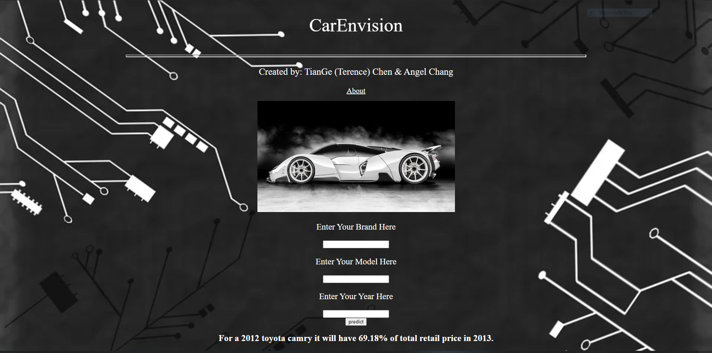

# CarEnvision
CarEnvision is a program that predicts your car's future or past values given a specific year.

## Tech Used
-Python 3.8  
-HTML 5     
-Google Cloud Platform  
-SKLearn  
-TextBlob  

## About
CarEnvision is a program that predicts your car's future or past values given a specific year.  
The information is extracted from Cars.com and placed through Machine Learning algorithms to predict a final value.  
Predicted value is based off of sentiments from professional car enthusiasts.  
We used three sets of car examples in order to train our Machine Learning algorithms.

## Example
 

## URL to webpage
https://carenvision.wl.r.appspot.com/

## Creators & Mentor
Creators: TianGe (Terence) Chen & Angel Chang  
Mentor: Evan Gunnell
